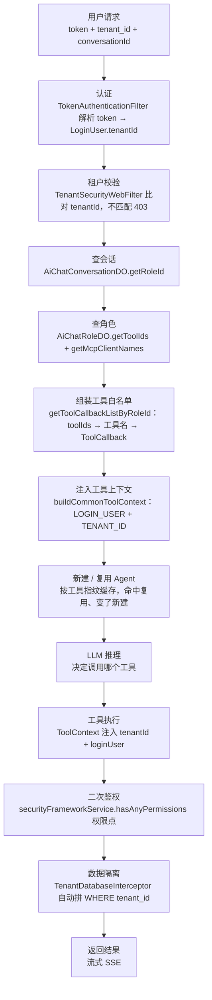

# 多租户 RBAC 的 Agent 工具权限：从业界共识到芋道落地

> 本文按四步展开：**① 综述业界做法 → ② 摸清芋道项目结构 → ③ 具体粒度流程图 → ④ 成熟代码范例**。
> 每一个「芋道落点」都对应真实源码（类名 / 方法 / 字段），业界说法均来自本次搜索的权威来源。

---

## 一、综述：业界怎么做「多租户 + RBAC + Agent 工具」

来源：WorkOS、Zylos Research、cnblogs、bix-tech、Auth0、agentpatterns.tech、Maxim/Bifrost、Descope、AWS Bedrock。

### 1.1 核心共识：一个 RBAC 多层模型，两个 enforcement 时机

业界不把「工具权限」「租户隔离」当两件事，而是抽象成一个**多层模型**，其中工具权限有两个**强制执行的时机**：

| 层 | 控制什么 | 时机 | 芋道落点 |
|---|---|---|---|
| 工具注册时过滤 | agent 只能「看到」授权工具 | 构建 agent 前 | `AiChatRoleDO.toolIds` |
| 工具执行时鉴权 | 真调时再验一次权限点 | 工具 `execute` 内 | `SecurityFrameworkService.hasAnyPermissions` |
| 租户隔离（scope） | 只能碰自己租户的数据 | 数据层 | `TenantDatabaseInterceptor` |
| 默认拒绝 | 没授权 = 零工具 | 全程 | 角色 `toolIds` 为空 → 无工具 |

**为什么要两个时机都做**：只过滤（注册时）会被 prompt 注入绕过；只鉴权（执行时）会让 LLM 看到无权工具（浪费 token + 泄露工具存在性）。两层叠加才是最小权限。

### 1.2 六条关键设计原则（业界反复强调）

1. **deny by default（默认拒绝）**：默认零权限，显式授权。Auth0：「By default, the agent should not have any tool access」；WorkOS 代码里「工具不在映射表就 `throw Denying by default`」。
2. **鉴权必须落在工具执行逻辑内，LLM 无法绕过**。Auth0 原话：「do this within the tools' execution logic so that the LLM does not have any way to override this」。
3. **token 携带 claims**（role / scope / tenantId）。bix-tech、Zylos、WorkOS 一致：身份和租户从 token 的 claims 里来，不是请求方随便传的。
4. **租户边界是资源层级节点，不是 SQL 里的 WHERE 子句**。WorkOS（FGA）：`Tenant A` 的子树永远到不了 `Tenant B`，因为两者在授权模型里无连接。
5. **policy layer / gateway 集中决策**。agentpatterns.tech：策略层夹在 runtime 和 tools 之间，每个调用都过它做 allow / deny / approval 决策并记审计。
6. **FGA / ReBAC 数据级细粒度**。Auth0：「RBAC 回答『这类 agent 能不能执行这类动作』，FGA 回答『它能不能碰这个租户里的这个具体资源』」。

### 1.3 三种多租户隔离架构（Zylos）

| 架构 | 隔离强度 | 成本 | 适用 |
|---|---|---|---|
| 每租户独立进程 | 最强 | 最高 | 监管行业、高价值租户 |
| **每租户凭证 + 共享进程** | 实用 | 中 | **B2B SaaS 默认** |
| 共享 agent + 策略租户标签 | 最弱 | 最低 | 消费者应用、低风险 |

芋道属于**「每租户凭证 + 共享进程」**：共享一套服务和 DB，靠「登录态里的 `tenantId` + SQL 自动拼租户条件」做隔离，等价于业界说的 RLS（行级安全）。

### 1.4 两句精辟总结

- **Descope**：「Scopes control what the user can do; tenant controls where」——权限决定「能做什么」，租户决定「在哪个数据空间做」。
- **WorkOS**：「RBAC handles "can this agent type perform this action type?"; FGA handles "can it act on this specific resource in this tenant?"」

---

## 二、本文项目结构（芋道真实源码）

### 2.1 Java 侧：module-ai + framework

**⚠️ 一个必须知道的事实：芋道工具定义三代写法并存**（版本演进未统一）：

| 代 | 写法 | 代表文件 | 有无租户上下文 |
|---|---|---|---|
| 旧 | `@Component("weather_query")` + `implements Function<Req,Resp>` + `@JsonClassDescription` | `WeatherQueryToolFunction`、`DirectoryListToolFunction` | ❌ 无 |
| 过渡 | `@Component("user_profile_query")` + `implements BiFunction<Req, ToolContext, Resp>` | `UserProfileQueryToolFunction` | ✅ 有（ToolContext 取 tenantId） |
| 新 | `@Component` + `@Tool(name="db_query")` + `@ToolParam` | `DbQueryToolFunction`、`PersonServiceImpl` | ✅ 有（ToolContext + 表名白名单） |

**工具名 = Bean 名**：`AiToolDO.name` 注释明确「对应 Bean 的名字，如 `DirectoryListToolFunction` 的 Bean 名是 `directory_list`」。

关键文件（相对 `yudao-module-ai-server/src/main/java/.../module/ai/`）：

```
tool/function/          # 工具定义（三代并存）
  ├─ WeatherQueryToolFunction.java      旧：Function，无租户
  ├─ DirectoryListToolFunction.java     旧：Function，无租户
  ├─ UserProfileQueryToolFunction.java  过渡：BiFunction + ToolContext（租户）
  └─ DbQueryToolFunction.java           新：@Tool + ToolContext + 白名单
tool/method/            # Spring AI 官方示例
  └─ PersonServiceImpl.java             新：@Service + @Tool
dal/dataobject/model/
  ├─ AiChatRoleDO.java      # AI 聊天角色：toolIds / mcpClientNames / modelId / knowledgeIds / systemMessage
  ├─ AiToolDO.java          # 工具表：name（= Bean 名）/ description
  └─ AiModelDO.java         # 模型表
dal/dataobject/chat/
  ├─ AiChatConversationDO.java   # 会话：roleId
  └─ AiChatMessageDO.java        # 消息
service/chat/AiChatMessageServiceImpl.java   # getToolCallbackListByRoleId：角色→工具→ToolCallback
framework/security/config/SecurityConfiguration.java   # MCP 端点 permitAll（需改 authenticated）
```

租户与安全框架（`yudao-framework/`）：

```
yudao-spring-boot-starter-biz-tenant/core/
  ├─ context/TenantContextHolder.java   # ThreadLocal 存 tenantId
  ├─ security/TenantSecurityWebFilter.java   # 越权校验 → 403
  ├─ db/TenantDatabaseInterceptor.java  # SQL 自动拼 tenant_id
  ├─ db/TenantBaseDO.java               # tenantId 字段（隔离表继承它）
  └─ util/TenantUtils.java              # execute(tenantId, ...) 临时切租户
yudao-spring-boot-starter-security/core/
  ├─ filter/TokenAuthenticationFilter.java   # token → LoginUser.tenantId
  ├─ LoginUser.java                          # tenantId / id / scopes
  └─ service/SecurityFrameworkService.java   # hasAnyPermissions（二次鉴权）
```

### 2.2 Python 侧：module-agent

```
core/
  ├─ agent.py          # create_agent（research / code_review / rag 三个 agent）
  ├─ memory.py         # checkpointer（短时）+ store（长时）
  └─ tool/
      ├─ tools.py      # web_search / code_review / kb_search
      ├─ api_tools.py  # 微服务工具（内部注入 token）
      └─ memory_tools.py   # 长期记忆（InjectedStore）
app/
  ├─ main.py           # FastAPI + lifespan + 中间件
  ├─ routers/chat.py   # chat 接口
  ├─ services/agent_service.py   # invoke / stream / select_agent
  └─ dependencies.py   # 依赖注入
```

---

## 三、流程图（具体粒度）

下图节点细化到「查会话拿 roleId」「按工具指纹新建 Agent」这一级动作，颜色区分：**蓝色 = Java 侧（框架内置）**，**橙色 = Python 侧（你要写）**，灰色 = 请求/响应。



**流程分界（重要）**：

- 步骤 B/C/L 是**芋道框架内置**（`TokenAuthenticationFilter`、`TenantSecurityWebFilter`、`TenantDatabaseInterceptor`），你一行不写。
- 步骤 D/E/F 是**芋道 module-ai 已实现**（`getToolCallbackListByRoleId` 真实存在）。
- 步骤 H/I 是 **module-agent（Python）侧你要写的**——芋道 Java 侧只负责「按角色给出工具白名单」，把「挂哪些工具建 Agent」留给 Python 侧（当前 `core/agent.py` 写死三个 Agent，没按角色动态选，是待补缺口）。

---

## 四、成熟代码范例

下面给一套「能直接照抄、融合了业界六条原则 + 芋道真实写法」的范例。**Java 侧负责工具定义与双层鉴权，Python 侧负责按角色动态建 Agent。**

### 4.1 Java 侧：一个成熟的工具（租户隔离 + 权限二次鉴权 + 参数白名单）

```java
package cn.iocoder.yudao.module.ai.tool.function;

import cn.iocoder.yudao.framework.security.core.LoginUser;
import cn.iocoder.yudao.framework.security.core.service.SecurityFrameworkService;
import cn.iocoder.yudao.framework.tenant.core.util.TenantUtils;
import cn.iocoder.yudao.module.ai.util.AiUtils;
import jakarta.annotation.Resource;
import org.springframework.ai.chat.model.ToolContext;
import org.springframework.ai.tool.annotation.Tool;
import org.springframework.ai.tool.annotation.ToolParam;
import org.springframework.security.access.AccessDeniedException;
import org.springframework.stereotype.Component;

/**
 * 成熟工具范例：查询订单。
 * 三层防线：① 权限点二次鉴权 ② 租户上下文校验 ③ 数据隔离（TenantUtils + MyBatis 自动拼 tenant_id）
 */
@Component
public class OrderQueryToolFunction {

    @Resource
    private OrderService orderService;                              // ① 你的业务服务（范例假设，换成真实服务）

    @Resource
    private SecurityFrameworkService securityFrameworkService;      // ② 芋道权限服务（框架内置）

    @Tool(name = "query_order", description = "查询订单详情，自动按当前登录用户的租户隔离")
    public OrderResponse query(
            @ToolParam(description = "订单号") String orderNo,
            ToolContext toolContext                                  // ③ 框架自动注入 LOGIN_USER + TENANT_ID
    ) {
        // ===== 防线 1：权限二次鉴权（deny by default，LLM 无法绕过）=====
        // SecurityFrameworkService 内部 getLoginUserId() → permissionApi → 缓存 1 分钟
        if (!securityFrameworkService.hasAnyPermissions("ai:tool:query-order")) {
            throw new AccessDeniedException("无权限使用该工具");
        }

        // ===== 防线 2：租户上下文校验（没登录上下文直接拒）=====
        Long tenantId = (Long) toolContext.getContext().get(AiUtils.TOOL_CONTEXT_TENANT_ID);
        LoginUser loginUser = (LoginUser) toolContext.getContext().get(AiUtils.TOOL_CONTEXT_LOGIN_USER);
        if (tenantId == null || loginUser == null) {
            throw new AccessDeniedException("无登录上下文，拒绝执行");
        }

        // ===== 防线 3：数据隔离 =====
        // TenantUtils.execute 临时切到当前租户；走 MyBatis-Plus 的表自动拼 tenant_id
        return TenantUtils.execute(tenantId, () -> {
            OrderDO order = orderService.getByOrderNo(orderNo);
            return BeanUtils.toBean(order, OrderResponse.class);
        });
    }
}
```

> **要点**：`@Tool(name=...)` 定义工具名；`ToolContext` 由 `AiUtils.buildCommonToolContext()` 注入（真实代码 `AiUtils.java` 第 156–161 行）；`SecurityFrameworkService.hasAnyPermissions` 是芋道二次鉴权的正确入口（**不要直接调 `permissionApi`**，它是 Feign 接口返回 `CommonResult`）。

### 4.2 Java 侧：工具表 + 角色绑定（数据模型）

```java
// AiToolDO.name = 工具名（对应 Bean 名，真实代码注释原文）
// ai_tool 表里存一条：name="query_order"，description="查询订单详情"

// AiChatRoleDO.toolIds = 角色绑定的工具编号列表（真实字段）
// 在芋道后台「角色管理」里给某个 AI 聊天角色勾选 query_order，
// 就是往 ai_chat_role.tool_ids 里加一条工具 id。
```

### 4.3 Python 侧：按角色动态建 Agent（工具加载 + 角色来源 + 指纹缓存，衔接文档 07）

这一段容易写孤立，先厘清**三个不同时机**，别混在一起：

| 环节 | 时机 | 对应 |
|---|---|---|
| 工具加载 | lifespan（MCP 异步 `await`） | 文档 07 阶段五 |
| 角色 → 工具白名单 | 每次请求（跨服务查 module-ai） | 文档 10 步骤⑤⑥ |
| Agent 构建 | 请求时按指纹缓存（同步） | 文档 10 步骤⑥ |

**① 工具全集组装（衔接文档 07 的 lifespan，没抛弃）**

```python
# core/tool/registry.py —— 工具注册表
def build_tool_registry(mcp_tools: list) -> dict[str, object]:
    """把「本地工具 + MCP 工具」合并成 {工具名: 工具对象}。

    mcp_tools 来自 lifespan 里 await McpToolLoader.load()（文档 07 阶段五），
    本地工具来自 core/tool/ 下的 @tool 定义。
    """
    from core.tool.tools import web_search, code_review
    from core.tool.api_tools import api_tools
    from core.tool.memory_tools import memory_tools

    registry = {}
    for t in [web_search, code_review] + api_tools + memory_tools + list(mcp_tools):
        registry[t.name] = t          # 工具名 → 工具对象
    return registry
```

```python
# app/main.py —— lifespan 里组装（这就是文档 07 阶段五的加载方式）
@asynccontextmanager
async def lifespan(app: FastAPI):
    mcp_loader = McpToolLoader(settings.mcp_url, settings.mcp_token)
    mcp_tools = await mcp_loader.load()                      # ① 异步拉 MCP 工具
    app.state.tool_registry = build_tool_registry(mcp_tools) # ② 组装工具全集
    yield
    await mcp_loader.close()
```

**② 角色来源（跨服务，⚠️ 需要 module-ai 暴露接口，是真实缺口）**

```python
# core/rbac.py —— 会话 → 角色 → 工具白名单
async def resolve_role_id(thread_id: str) -> str:
    """① 会话 → roleId。生产：调 module-ai 查会话（跨服务，带 token）。
    芋道 AiChatConversationDO 有 roleId 字段。"""
    conv = await module_ai_api.get_conversation(thread_id)   # ⚠️ module-ai 目前未暴露此接口
    return conv.role_id

async def resolve_tool_names_for_role(role_id: str) -> set[str]:
    """② 角色 → 工具名列表。生产：调 module-ai 查 ai_chat_role.tool_ids。"""
    role = await module_ai_api.get_chat_role(role_id)        # ⚠️ module-ai 目前未暴露此接口
    return set(role.tool_ids or [])
```

**③ 按工具指纹缓存 Agent（讲清 frozenset 原理）**

```python
# core/agent_factory.py
_agent_cache: dict[frozenset, object] = {}

def get_agent_for_tool_names(tool_names: set[str], registry: dict):
    """按「工具名集合」取 Agent。

    为什么用 frozenset 作 key：
    - set 不可哈希，不能作 dict 的 key；frozenset 是不可变集合，可以哈希。
    - 所以「工具名集合的 frozenset」就是这个 agent 的「指纹」。
    - 两个角色绑定的工具集合相同 → 指纹相同 → 复用同一个 agent 实例。
    """
    key = frozenset(tool_names)
    agent = _agent_cache.get(key)
    if agent is None:
        agent = create_agent(
            model=deepseek_model,
            tools=[registry[n] for n in key if n in registry],  # 按名从工具全集取
            checkpointer=checkpointer,          # 短时记忆（框架内置）
            store=store,                        # 长时记忆（框架内置）
            system_prompt="你是业务顾问，用授权工具回答。",
        )
        _agent_cache[key] = agent
    return agent
```

**④ 拼起来（一次请求的完整编排）**

```python
async def _build_context(self, req, request):
    role_id = await resolve_role_id(req.thread_id)                    # ① 会话 → roleId
    tool_names = await resolve_tool_names_for_role(role_id)           # ② 角色 → 工具名
    agent = get_agent_for_tool_names(tool_names, request.app.state.tool_registry)  # ③ 指纹取 agent
    config = {"configurable": {"thread_id": req.thread_id}}
    return {"agent": agent, "config": config}
```

> **架构缺口（诚实摊开）**：② 里的 `module_ai_api.get_conversation` / `get_chat_role` 是**示意接口名**，芋道 module-ai 目前**没有为外部暴露**「查会话角色 / 查角色工具」的 HTTP 接口——它内部的 `getToolCallbackListByRoleId` 只给自己的 chat 服务用。
> 两条路：
> - **路 A（上面写的）**：Python 侧自己跨服务查角色→工具，需 module-ai 新增两个接口 + Python 侧 token 透传。
> - **路 B（业界主流，Bifrost/Descope）**：让 MCP 端点按用户过滤工具（per-user tool filtering），Python 侧拉到的天然是过滤后的工具，不用自己查角色。芋道目前 MCP 端点 `permitAll`、不做 per-user filtering，需改 MCP 端鉴权。

### 4.4 完整请求链路（把三段拼起来）

```
用户请求（token + tenant_id + conversationId）
   │
   ▼  [Java] TokenAuthenticationFilter：token → LoginUser.tenantId
   ▼  [Java] TenantSecurityWebFilter：租户不匹配 403
   ▼  [Java] getToolCallbackListByRoleId：会话.roleId → 角色.toolIds → ToolCallback
   ▼  [Python] resolve_role_id → resolve_tool_names_for_role → get_agent_for_tool_names：按工具指纹新建/复用 Agent
   ▼  [Python] LLM 推理 → 决定调 query_order
   ▼  [Java] query_order：hasAnyPermissions 二次鉴权 → ToolContext 取 tenantId → TenantUtils + 自动拼 tenant_id
   ▼  返回结果（流式 SSE）
```

---

## 五、一句话收尾

业界共识是一条「**默认拒绝 → 注册时过滤 → 执行时鉴权 → 数据按租户隔离**」的链；芋道把「注册时过滤（`AiChatRoleDO.toolIds`）」「执行时鉴权（`hasAnyPermissions`）」「数据隔离（`TenantDatabaseInterceptor`）」三层都内置了，你只需补两件：**工具方法内照 4.1 写二次鉴权 + 租户上下文，Python 侧照 4.3 按角色动态建 Agent**。工具名的坑是「= Bean 名」，别和 `@Tool(name=...)` 的 name 混。
