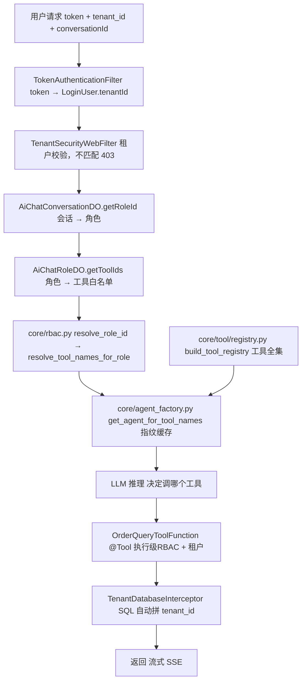

# 代码 ③ ④：文件目录编排（文档 12 多租户 RBAC 配套）

> 本文是 `12-multi-tenant-rbac-agent-tool.md` 第四章两段落地代码的**目录编排版**。
> 正文里代码是「按讲解顺序」散的（Java 工具 → 数据模型 → Python 四小段），这里把它们按**真实工程落点**重新归位成目录树，回答三个问题：
> **① 每个文件该放哪个目录；② 谁依赖谁；③ 哪些是框架/工程已有、哪些要自己写（分界不糊）。**
>
> 与 `13-代码目录编排.md`（文档 13 代码①②的编排）配套：那边讲「工具经 MCP 暴露 + 生产级会话接口」，这边讲「多租户 RBAC 的**工具权限**落地」——**Java 侧负责工具定义与双层鉴权，Python 侧负责按角色动态建 Agent**。
>
> 约定与文档 12 一致：除标注「已有/已落地」者外，其余均为**讲解用范例**，未写入工程；包名/路径遵循项目现有结构，可直接对照落位。

---

## 一、重新编排后的目录大纲（规整 TOC）

文档 12 第四章的代码块按「谁在哪一层干活」归成两段，内部再拆小节：

```
代码 ③（文档12 第四章·Java 侧）module-ai：工具定义 + 双层鉴权 + 租户隔离
  4.1  Java 业务工具（@Tool + RBAC 二次鉴权 + 租户上下文 + 数据隔离）  → OrderQueryToolFunction.java
  4.2  工具表 / 角色绑定（数据模型，已有，后台配置即可）               → AiToolDO.java + AiChatRoleDO.java（不写代码）

代码 ④（文档12 第四章·Python 侧）module-agent：按角色动态建 Agent
  4.3① 工具全集组装（本地 + MCP 合并）                               → core/tool/registry.py + app/main.py(lifespan)
  4.3② 角色来源（会话→roleId→toolIds，跨服务查 module-ai）            → core/rbac.py
  4.3③ 按工具指纹缓存 Agent（frozenset 原理）                        → core/agent_factory.py
  4.3④ 拼起来（一次请求的完整编排）                                  → app/services/agent_service.py（文档13 演进为 chat_orchestrator.py）
```

---

## 二、Java 侧（module-ai）目录树 —— 代码③

```
yudao-module-ai-server/
└── src/main/java/cn/iocoder/yudao/module/ai/
    ├── tool/function/
    │   └── OrderQueryToolFunction.java      ← 4.1  业务工具（@Tool，三层防线）
    └── dal/dataobject/model/
        ├── AiToolDO.java                    ← 4.2  工具表：name = Bean 名（已有）
        └── AiChatRoleDO.java                ← 4.2  角色表：toolIds 绑定工具（已有）
```

| 文件 | 职责 | 对应小节 | 状态 | 关键点 |
|------|------|---------|------|--------|
| `tool/function/OrderQueryToolFunction.java` | `@Tool(name="query_order")` 定义业务工具；方法内做**三层防线**：① `hasAnyPermissions` 权限点二次鉴权 → ② `toolContext` 取 `LOGIN_USER`+`TENANT_ID` 校验非空 → ③ `TenantUtils.execute` 切租户 + MyBatis 自动拼 `tenant_id` | 4.1 | 讲解范例（新写） | 与项目里三代工具同目录（`WeatherQueryToolFunction`/`UserProfileQueryToolFunction`/`DbQueryToolFunction`）；`ToolContext` 由 `AiUtils.buildCommonToolContext()` 注入，**不自己 new** |
| `dal/dataobject/model/AiToolDO.java` | 工具表实体，`name` 字段 = 工具 Bean 名 | 4.2 | **已有，配置用** | 后台往 `ai_tool` 加一条 `name="query_order"` 即可，不写代码 |
| `dal/dataobject/model/AiChatRoleDO.java` | AI 聊天角色实体，`toolIds` = 角色绑定的工具编号列表 | 4.2 | **已有，配置用** | 后台「角色管理」勾选工具 = 往 `ai_chat_role.tool_ids` 加工具 id |

**代码③不碰、但必须知道的框架侧（yudao-framework，一行不写，全是内置）：**

```
yudao-framework/
├── yudao-spring-boot-starter-biz-tenant/core/
│   ├── context/TenantContextHolder.java     # ThreadLocal 存 tenantId
│   ├── security/TenantSecurityWebFilter.java # 越权校验 → 403
│   ├── db/TenantDatabaseInterceptor.java     # SQL 自动拼 tenant_id（数据隔离核心）
│   ├── db/TenantBaseDO.java                  # tenantId 字段（隔离表继承它）
│   └── util/TenantUtils.java                 # execute(tenantId, ...) 临时切租户
└── yudao-spring-boot-starter-security/core/
    ├── filter/TokenAuthenticationFilter.java # token → LoginUser.tenantId
    ├── LoginUser.java                        # tenantId / id / scopes
    └── service/SecurityFrameworkService.java # hasAnyPermissions（二次鉴权正确入口）
```

> 另外 `service/chat/AiChatMessageServiceImpl.java` 的 `getToolCallbackListByRoleId`（角色→工具→ToolCallback）是 module-ai **已实现**的；`util/AiUtils.java` 的 `buildCommonToolContext()` 注入 `LOGIN_USER`+`TENANT_ID`，也是已有。代码③只补一个 `OrderQueryToolFunction` 范例。

---

## 三、Python 侧（module-agent）目录树 —— 代码④

```
yudao-module-agent/
├── core/
│   ├── agent_factory.py              ← 4.3③  按工具指纹缓存 Agent（frozenset）
│   ├── rbac.py                       ← 4.3②  会话→角色→工具白名单（跨服务）
│   └── tool/
│       └── registry.py               ← 4.3①  工具全集组装（本地 + MCP）
└── app/
    ├── main.py                       ← 4.3①  lifespan 里组装工具全集
    └── services/
        └── agent_service.py          ← 4.3④  编排：role→工具→agent→config
```

| 文件 | 职责 | 对应小节 | 状态 | 关键点 |
|------|------|---------|------|--------|
| `core/tool/registry.py` | `build_tool_registry(mcp_tools)`：把「本地工具 + MCP 工具」合并成 `{工具名: 工具对象}` | 4.3① | 讲解范例（新写） | ⚠️ 文档 12 正文里 `from core.tool.memory_tools import memory_tools` 是**旧全局版**——该文件 2026-09-01 已删；落位时改成 `from core.tool.memory_tools_tenant import make_memory_tools`，且记忆工具**请求时按 `(tenant_id, user_id)` 生成**，不能是模块级全局列表（详见文档 13 §4.3 文件2） |
| `app/main.py`（lifespan 增量） | `app.state.tool_registry = build_tool_registry(mcp_tools)`：启动期 `await` 拉 MCP 工具、组装全集、关闭时释放 | 4.3① | 增量范例 | 衔接文档 07 阶段五「lifespan 异步加载」；MCP 工具是异步加载的，放启动期而不是首个请求 |
| `core/rbac.py` | `resolve_role_id(thread_id)`：会话→roleId；`resolve_tool_names_for_role(role_id)`：角色→toolIds | 4.3② | 讲解范例（新写） | ⚠️ `module_ai_api.get_conversation`/`get_chat_role` 是**示意接口名**，module-ai 目前未暴露，需先补（见第六节缺口 1） |
| `core/agent_factory.py` | `get_agent_for_tool_names(tool_names, registry)`：按 `frozenset(工具名集合)` 作指纹缓存 Agent，命中复用、变了新建 | 4.3③ | 讲解范例（新写） | `set` 不可哈希，`frozenset` 可哈希才能当 dict 的 key；「工具集合相同 = 同一指纹 = 复用实例」 |
| `app/services/agent_service.py` | `_build_context(req, request)`：把 ①②③ 串起来——`role_id→tool_names→agent→config` | 4.3④ | 讲解范例（增量） | 现有 `agent_service.py` 是意图路由版（`invoke`/`stream`/`select_agent`）；文档 13 代码② 把它演进成独立的 `app/services/chat_orchestrator.py` |

---

## 四、两段代码的调用链（谁依赖谁）



三条依赖关系要记牢：

1. **`agent_factory.py` 是 Python 侧枢纽**：它同时被 `rbac.py`（喂角色→工具名）和 `registry.py`（喂工具全集）供料，产出「按指纹缓存」的 agent。`agent_service.py` 只做顺序编排，不自己造 agent。
2. **角色→工具这条边是跨进程的**：`rbac.py` 要调 module-ai 查 `ai_chat_role.tool_ids`（路 A），或让 MCP 端点按用户过滤工具（路 B）。这是整条链路**唯一没打通**的边（见第六节缺口 1/4）。
3. **鉴权+数据隔离都在 Java 侧闭环**：`OrderQueryToolFunction` 里的二次鉴权、`TenantDatabaseInterceptor` 的 SQL 拼租户，都发生在 module-ai 进程内，Python 侧**只管「挂哪些工具」**，碰不到租户数据。

---

## 五、框架内置 vs 自己写（落点归类）

| 能力 | 框架/项目已有（不用写，直接 import/复用） | 自己写（本文示例补的落点） |
|------|------------------------------------------|--------------------------|
| 工具定义 | `@Tool` 注解 + `AiUtils.buildCommonToolContext()` | `OrderQueryToolFunction` 的三层防线逻辑 |
| 工具→角色绑定 | `AiToolDO` / `AiChatRoleDO`（后台配置） | 无（纯配置） |
| 注册时过滤 | `getToolCallbackListByRoleId`（module-ai 已实现） | `rbac.py` 跨服务查询（路 A）或 MCP per-user filtering（路 B） |
| 执行时鉴权 | `SecurityFrameworkService.hasAnyPermissions` | 在工具方法内**主动调用**它（不直接调 `permissionApi`） |
| 租户隔离 | `TenantContextHolder` / `TenantSecurityWebFilter` / `TenantDatabaseInterceptor` / `TenantUtils` | 无（工具内 `TenantUtils.execute` 包一层即可） |
| 身份解析 | `TokenAuthenticationFilter` → `LoginUser` | 无 |
| 工具全集组装 | `langchain-mcp-adapters`（客户端） | `registry.py` 的合并逻辑 + `main.py` lifespan |
| Agent 指纹缓存 | LangGraph `create_agent` + `checkpointer` + `store` | `agent_factory.py` 的 `frozenset` 缓存 |
| 请求编排 | `agent_service.py`（意图路由版） | `_build_context` 的 role→工具→agent 顺序 |

---

## 六、生产缺口清单（哪些是「示意接口名」，落位前必须先补）

目录编排把文件摆好了，但**不是所有文件都能直接落位**——有几处是文档 12 §4.3「架构缺口」点名的真实短板：

| # | 缺口 | 涉及文件 | 影响 |
|---|------|---------|------|
| 1 | module-ai 未暴露「查会话 roleId / 查角色 toolIds」的 HTTP 接口 | `core/rbac.py` | `module_ai_api.get_conversation`/`get_chat_role` 是示意名；生产要么 module-ai 补两个接口（路 A），要么 MCP 端点做 per-user tool filtering（路 B） |
| 2 | MCP 业务工具跨租户身份透传未打通 | `core/tool/registry.py` 汇入的 MCP 工具 | 现有 `api_tools.py` 用全局内部 token 会打穿租户隔离，必须换成透传终端用户 token（与文档 13 §3.3 同源缺口） |
| 3 | 短期记忆 `thread_id` 无租户命名空间 | `app/services/agent_service.py` 的 config | `thread_id` 裸奔时，checkpointer 撞名可读他租户会话；应改为 `租户:用户:会话` 命名 |
| 4 | MCP 端点当前 `permitAll`、不做 per-user filtering | module-ai 安全链路 | 不纳入 token 校验，租户上下文写不进 `TenantContextHolder`，Java 三层隔离失效 |
| 5 | `registry.py` 引用了已删除的全局 `memory_tools` | `core/tool/registry.py` | 必须改成 `memory_tools_tenant.make_memory_tools(tenant_id, user_id)`，否则跨租户记忆泄露（2026-09-01 已删全局版的原因） |

---

## 七、一张表看懂「目录编排后要动哪些文件」

| 序号 | 文件 | 动/不动 | 动作 |
|------|------|--------|------|
| 1 | `tool/function/OrderQueryToolFunction.java` | 新增 | 写 `@Tool` 业务工具（三层防线） |
| 2 | `dal/dataobject/model/AiToolDO.java` | 不动 | 后台 `ai_tool` 加 `query_order` 记录 |
| 3 | `dal/dataobject/model/AiChatRoleDO.java` | 不动 | 后台给角色勾选工具 |
| 4 | `core/tool/registry.py` | 新增 | 工具全集组装（记忆工具改租户化工厂） |
| 5 | `app/main.py` | 改 | lifespan 组装工具全集 |
| 6 | `core/rbac.py` | 新增 | 会话→角色→工具（先补 module-ai 接口） |
| 7 | `core/agent_factory.py` | 新增 | frozenset 指纹缓存 Agent |
| 8 | `app/services/agent_service.py` | 改 | `_build_context` 编排（文档 13 演进为 orchestrator） |
