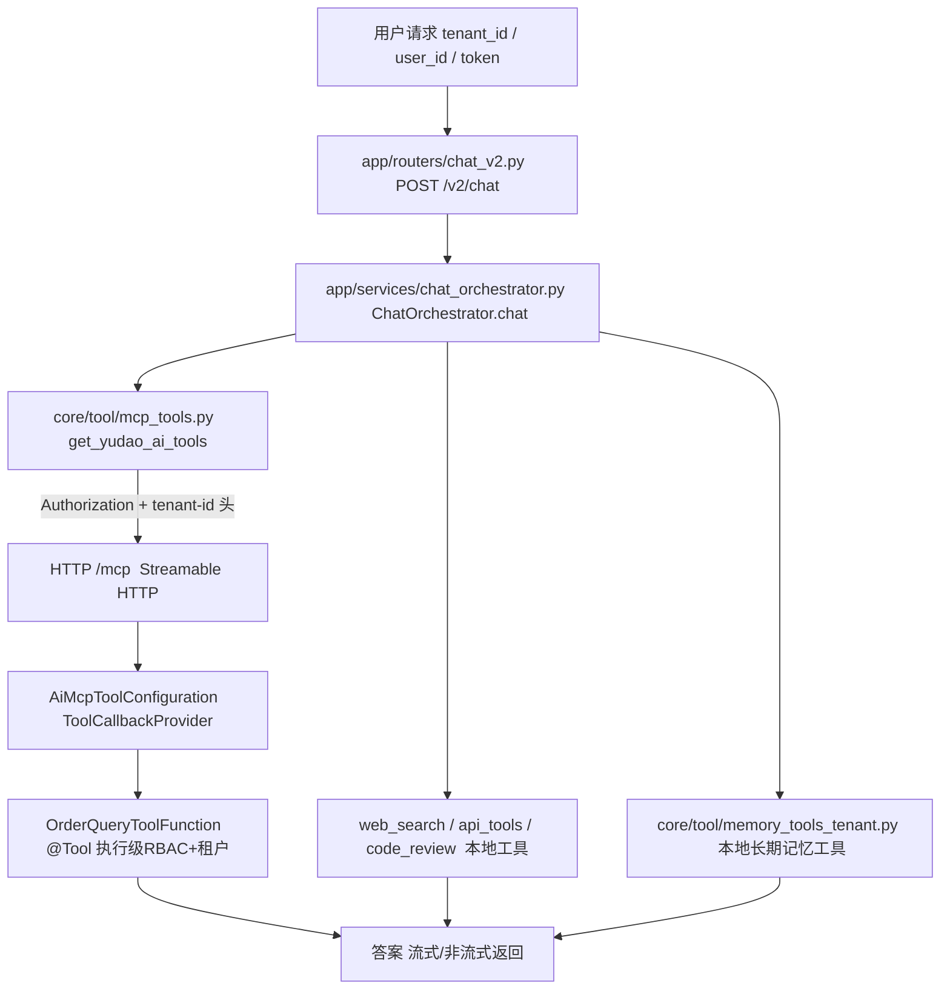

# 代码 ① ②：文件目录编排（文档 13 第三、四章配套）

> 本文是 `13-mcp-langchain-multitenant-agent-chat.md` 第三、四章两段落地代码的**目录编排版**。
> 正文里代码是「按讲解顺序」散的，这里把它们按**真实工程落点**重新归位成目录树，回答三个问题：
> **① 每个文件该放哪个目录；② 谁依赖谁；③ 哪些是框架/工程已有、哪些要自己写（分界不糊）。**
>
> 约定与文档 13 一致：除标注「已落地」者外，其余均为**讲解用范例**，未写入工程；包名/路径遵循项目现有结构，可直接对照落位。

---

## 一、重新编排后的目录大纲（规整 TOC）

原文档 13 的章节号里混着「第二步的产出 / 第三步的产出」这种流水号，和 `4.1/4.3` 对不上。这里统一成「代码 → 小节 → 文件」三层，一目了然：

```
代码 ①（第三章）module-ai 注册工具 → module-agent 经 MCP 使用
  3.1  Java 定义业务工具（@Tool + 执行级 RBAC + 租户隔离）   → OrderQueryToolFunction.java
  3.2  Java 注册 ToolCallbackProvider 经 Streamable HTTP 暴露 → AiMcpToolConfiguration.java + application.yaml
  3.3  Python 经 langchain-mcp-adapters 使用（租户头+角色过滤）→ mcp_tools.py + build_research_agent

代码 ②（第四章）生产级全功能会话接口 /v2/chat
  4.1  生产要素清单（A1–F22）                                  → 无代码，盘点表
  4.2  管线设计（12 步）                                       → 无代码，流程图 + 分步
  4.3  完整示例代码（四个文件）
       文件 1  请求/响应模型                                    → app/schemas/chat_v2.py
       文件 2  两个小增量                                       → text_utils.py + memory_tools_tenant.py + settings.py
       文件 3  核心编排                                         → app/services/chat_orchestrator.py
       文件 4  路由 + 启动增量                                   → app/routers/chat_v2.py + main.py
  4.4  要素覆盖对照表                                          → 无代码，证明表
  4.5  框架内置 vs 自己写                                       → 无代码，分界表
```

---

## 二、Java 侧（module-ai）目录树

```
yudao-module-ai-server/
└── src/main/
    ├── java/cn/iocoder/yudao/module/ai/
    │   ├── tool/function/
    │   │   └── OrderQueryToolFunction.java      ← 3.1  业务工具（@Tool，新写法）
    │   └── framework/ai/config/
    │       └── AiMcpToolConfiguration.java       ← 3.2  ToolCallbackProvider → 经 /mcp 暴露
    └── resources/
        └── application.yaml                      ← 3.2  开 MCP server（Streamable HTTP /mcp）
```

| 文件 | 职责 | 对应小节 | 状态 | 关键点 |
|------|------|---------|------|--------|
| `tool/function/OrderQueryToolFunction.java` | 定义业务工具 `query_tenant_order`，方法内做执行级 RBAC + 靠 `TenantDatabaseInterceptor` 自动租户过滤 | 3.1 | 讲解范例 | 与项目里旧的 `DbQueryToolFunction`（`Function<Req,Resp>`）同目录；MCP 路径下读 `TenantContextHolder`/`SecurityFrameworkUtils`，**不读 `toolContext`** |
| `framework/ai/config/AiMcpToolConfiguration.java` | 把工具对象打成 `ToolCallbackProvider` Bean，被 `spring-ai-starter-mcp-server-webmvc` 自动收集暴露 | 3.2 | 讲解范例 | 走 `MethodToolCallbackProvider`；不走 `@McpTool` 注解扫描（项目因 spring-ai#4917 关闭了 annotation-scanner） |
| `application.yaml`（module-ai） | 打开 MCP server，从 SSE 升级到 Streamable HTTP | 3.2 | 改配置 | 现状 `enabled: false` + 只有 `sse-endpoint: /sse`；改为 `enabled: true` + 端点 `/mcp`，删旧 SSE |

---

## 三、Python 侧（module-agent）目录树

```
yudao-module-agent/
├── pyproject.toml                              ← 3.3       加依赖 langchain-mcp-adapters
├── config/
│   └── settings.py                             ← 4.3 文件2  追加 4 个新参数（F18）
├── core/
│   ├── agent.py                                ← 3.3       build_agent / build_research_agent（示例）
│   ├── text_utils.py                           ← 4.3 文件2  追加 detect_language（A1）
│   └── tool/
│       ├── mcp_tools.py                        ← 3.3       get_yudao_ai_tools（需新增）
│       └── memory_tools_tenant.py              ← 4.3 文件2  make_memory_tools（已落地）
└── app/
    ├── main.py                                 ← 4.3 文件4  lifespan 增量（init_orchestrator + 路由注册）
    ├── schemas/
    │   └── chat_v2.py                          ← 4.3 文件1  ChatRequestV2 / ChatMeta
    ├── services/
    │   └── chat_orchestrator.py                ← 4.3 文件3  核心编排类（12 步管线）
    └── routers/
        └── chat_v2.py                          ← 4.3 文件4  路由层（零业务逻辑）
```

| 文件 | 职责 | 对应小节 | 状态 | 关键点 |
|------|------|---------|------|--------|
| `pyproject.toml` | 增加 MCP 客户端依赖 | 3.3 | 需新增 | `uv add langchain-mcp-adapters`；当前项目没有此依赖 |
| `core/tool/mcp_tools.py` | `get_yudao_ai_tools(tenant_id, user_token, allowed_tools, force_refresh)`：按租户建 `MultiServerMCPClient`、透传用户 token、按角色白名单过滤、`(tenant, role)` 缓存 | 3.3 | 需新增 | 传输 `streamable_http`；headers 透传 `Authorization` + `tenant-id`，**绝不用内部 token** |
| `core/agent.py` | 按租户组装 agent（替代静态构建中「工具集固定」的部分） | 3.3 | 已有 `build_agent` | 工程里已有 `build_agent(kind, tenant_id, user_id)`；3.3 的 `build_research_agent` 是示例变体 |
| `app/schemas/chat_v2.py` | `ChatRequestV2`（身份三元组 tenant_id/user_id/token）+ `ChatMeta`（SSE meta 事件元信息） | 4.3 文件1 | 讲解范例 | 现有 `app/schemas/chat.py` 的 `ChatRequest` 已含 `tenant_id/user_id`（2026-09-02 加），`chat_v2` 是完整版范例 |
| `core/text_utils.py` | 追加 `detect_language(text) -> "zh"/"en"`（CJK 占比启发式） | 4.3 文件2 | 需新增 | A1；零依赖，多语种再换 langdetect，签名不变可替换 |
| `core/tool/memory_tools_tenant.py` | `make_memory_tools(tenant_id, user_id)` 工厂，namespace 固化为 `(users, 租户, 用户)` | 4.3 文件2 | **已落地** | 修复原全局 `memory_tools.py` 写死 `("users",)` 的跨租户漏洞；原文件 2026-09-01 已删除 |
| `config/settings.py` | 追加 `yudao_ai_mcp_url` / `chat_cache_ttl` / `chat_eval_sample_rate` / `chat_eval_file` | 4.3 文件2 | 需新增 | F18：新参数全进 settings |
| `app/services/chat_orchestrator.py` | `ChatOrchestrator.chat()`：12 步管线编排（A1–F22），含流式/非流式双路径 | 4.3 文件3 | 讲解范例 | 现有 `app/services/agent_service.py` 是意图路由版；这是生产级完整版范例 |
| `app/routers/chat_v2.py` | `POST /v2/chat` 路由，`Depends(ChatOrchestrator)`，零业务逻辑 | 4.3 文件4 | 讲解范例 | 现有 `app/routers/chat.py` 有 `/v1/chat`、`/v1/research`、`/v1/review` |
| `app/main.py` | lifespan 里 `init_orchestrator()` 预热检索器 + `include_router(chat_v2.router)` | 4.3 文件4 | 增量范例 | F22：重资源启动期建好，不在首个请求里做 |

---

## 四、两段代码的调用链（谁依赖谁）



三条依赖关系要记牢：

1. **`chat_orchestrator.py` 是唯一枢纽**：它同时调用 `mcp_tools`（跨服务取 MCP 工具）、`memory_tools_tenant`（本地长期记忆）、`text_utils`（语言检测）、`rag.*`（检索/缓存/评估）。路由层不碰这些，`main.py` 只负责启动预热。
2. **跨进程边界只有一处**：`mcp_tools.py` → `HTTP /mcp` → Java `ToolCallbackProvider`。租户/用户身份在这条边上靠 headers 透传，Java 侧从 token 解析身份，别的文件不直接跨进程。
3. **记忆/检索是 Python 进程内闭环**：`memory_tools_tenant` 和编排层共用 `core/memory.py` 的 `store` 单例，Java 的三层租户隔离（token 过滤 / `TenantSecurityWebFilter` / `TenantDatabaseInterceptor`）**管不到这个 Python 进程内 store**——所以 namespace 必须自己按 `(users, 租户, 用户)` 隔离（这正是 2026-09-01 删全局版、改用工厂的原因）。

---

## 五、框架内置 vs 自己写（落点归类）

| 能力 | 框架/项目已有（不用写，直接 import/复用） | 自己写（本文示例补的落点） |
|------|------------------------------------------|--------------------------|
| 短期记忆 | `core/memory.py` 的 `checkpointer`（自动存取） | thread_id 的租户命名空间（`租户:用户:会话`） |
| 长期记忆 | `core/memory.py` 的 `store`；LangGraph `InjectedStore` 机制 | `memory_tools_tenant.py` 租户化 namespace 工厂 |
| 意图/策略 | `core/rag/classifier.py` / `strategy.py` 整套 | `chat_orchestrator.py` 里的调用顺序编排 |
| 混合检索 | `core/rag/retriever.py` 的 `HybridRetriever` | 「何时预检索」的决策（4.2 决策 1） |
| 缓存 | `core/rag/cache.py` 的 `RedisCache`（含降级） | 缓存键设计 + 哪些策略可缓存 |
| 评估 | `core/rag/evaluate.py` 的 `EvalSample`/`RagasEvaluator` | 采样率 + 异步落盘接线 |
| MCP 客户端 | `langchain-mcp-adapters` 全包 | `mcp_tools.py` 的租户头 + 白名单 + 缓存失效 |
| SSE 流式 | `astream_events` + `StreamingResponse` | 事件协议 + 生成器内异常处理（E17） |
| 提示词 | `core/prompts/` 的 `loader`/`builders`/`templates/*.md` | 动态段（语言/记忆/上下文）组装规则 |
| Java 工具 | `ai_tool` 表 + `ToolCallbackResolver` + `SyncMcpToolCallbackProvider` | `OrderQueryToolFunction` 的 `@Tool` 新写法 + `AiMcpToolConfiguration` 暴露 |
| 鉴权/日志/异常 | `main.py` 中间件 + 三个 exception_handler | 直接复用，v2 不重复实现 |

---

## 六、生产缺口清单（哪些是「示意接口名」，落位前必须先补）

目录编排把文件摆好了，但**不是所有文件都能直接落位**——有几处是文档 12 §4.3「架构缺口」点名的真实短板，落位前必须知道：

| # | 缺口 | 涉及文件 | 影响 |
|---|------|---------|------|
| 1 | module-ai 未暴露「查会话 roleId / 查角色 toolIds」的 HTTP 接口 | `chat_orchestrator.py` 里 `ROLE_ALLOWED_TOOLS` 的生产替换（文档 12 路 A） | 静态 dict 只是示意；生产要么 module-ai 补两个接口（路 A），要么 MCP 端点做 per-user tool filtering（路 B） |
| 2 | MCP 业务工具跨租户身份透传未打通 | `mcp_tools.py`（需新增） | `api_tools.py` 现有做法用全局内部 token，会打穿租户隔离，必须换成透传终端用户 token |
| 3 | 短期记忆 thread_id 无租户命名空间 | `chat_orchestrator.py` 的 `thread_id` | 现有 `/v1` 接口仍裸奔；`/v2` 范例已用 `租户:用户:会话` 命名 |
| 4 | MCP 端点当前 `permitAll`、不做 per-user filtering | module-ai `application.yaml` / 安全链路 | 需把 `/mcp/**` 纳入 token 校验，否则租户上下文写不进 `TenantContextHolder` |

---

## 七、一张表看懂「目录编排后要动哪些文件」

| 序号 | 文件 | 动/不动 | 动作 |
|------|------|--------|------|
| 1 | `tool/function/OrderQueryToolFunction.java` | 新增 | 写 `@Tool` 业务工具 |
| 2 | `framework/ai/config/AiMcpToolConfiguration.java` | 新增 | 注册 `ToolCallbackProvider` |
| 3 | module-ai `application.yaml` | 改 | 开 MCP server、切 Streamable HTTP |
| 4 | `pyproject.toml` | 改 | 加 `langchain-mcp-adapters` |
| 5 | `core/tool/mcp_tools.py` | 新增 | MCP 加载器（租户头+角色过滤+缓存） |
| 6 | `core/agent.py` | 已有/改 | 用 `build_agent` 按身份组装 |
| 7 | `core/tool/memory_tools_tenant.py` | 已有 | **已落地，无需动** |
| 8 | `core/text_utils.py` | 改 | 追加 `detect_language` |
| 9 | `config/settings.py` | 改 | 追加 4 参数 |
| 10 | `app/schemas/chat_v2.py` | 新增 | v2 数据模型 |
| 11 | `app/services/chat_orchestrator.py` | 新增 | 核心编排 |
| 12 | `app/routers/chat_v2.py` | 新增 | 路由 |
| 13 | `app/main.py` | 改 | lifespan 增量 + 路由注册 |
